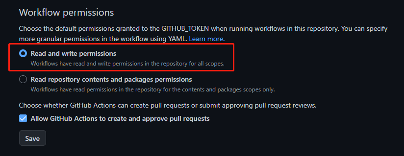
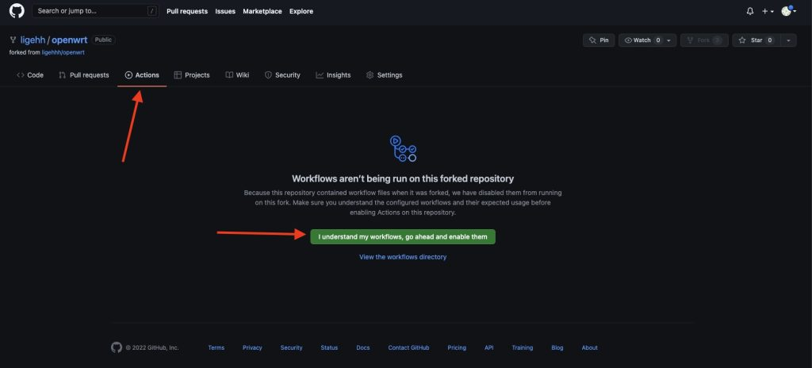
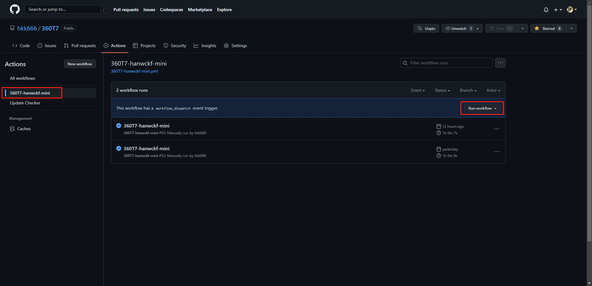

<div align="center"> 

<h1 align="center">

GitHub Actions For 360T7 OpenWrt

</h1>

[](https://github.com/hkk666/360T7/stargazers)
[](https://github.com/hkk666/360T7/network)
[](https://github.com/hkk666/360T7/issues)
[](https://github.com/hkk666/360T7/graphs/contributors)
[](https://github.com/hkk666/360T7/releases)
[](https://github.com/hkk666/360T7/blob/main/LICENSE)


</div>


## 友情提醒 🤣
此仓库只是拉取源码进行编译，本人并不会修复相关问题！

## 目录介绍 📖

```tree
360T7
├── .github/workflows
│   ├── 360T7-hanwckf-mini.yml             拉取 hanwckf 源码进行编译
│   ├── 360T7-padavanonly-mini.yml         拉取 padavanonly 源码进行编译
│   ├── update-checker.yml                 定时检查源码的更新情况
├── doc
│   ├── backup                             旧文件备份
│   ├── config
│   │   ├── 360T7-hanwckf-mini.config      固件定制
│   │   ├── 360T7-padavanonly-mini.config  固件定制
│   │   ├── ua2f.config                    ua2f 依赖
│   ├── diy                                自定义脚本文件
│   ├── img                                图片存放处
├── LICENSE
└── README.md
```

## 食用教程 🛠

### 1、Fork本仓库 📌
右上角 `Fork`  `star`可以给予鼓励。

### 2、仓库读写权限 🤔

前往Fork之后的仓库页面，按下图实例图示点击，更改读写权限。 



### 3、开始编译 🚀

前往Fork之后的仓库页面，按下图实例图示点击，等待编译结果即可。





## 特别鸣谢 🥰

|          [lean](https://github.com/coolsnowwolf/lede)         |        [天灵](https://github.com/1715173329)               |              [lorz](https://github.com/1orz/My-action)               |              [P3TERX](https://github.com/P3TERX/Actions-OpenWrt)               |          [Zxilly](https://github.com/Zxilly/UA2F)         |              [stupidloud](https://github.com/stupidloud/cachewrtbuild)               |              [hanwckf](https://github.com/hanwckf/immortalwrt-mt798x)               |              [padavanonly](https://github.com/padavanonly/immortalwrtARM/tree/mt7981)               |
| :----------------------------------------------------------: | :----------------------------------------------------------: | :----------------------------------------------------------: | :----------------------------------------------------------: | :----------------------------------------------------------: | :----------------------------------------------------------: | :----------------------------------------------------------: | :----------------------------------------------------------: |
|  |  |  |  |  |  |  |  |

## Star History

<hr>
 
[](https://star-history.com/#bytebase/star-history&Date)
 
 <hr>
