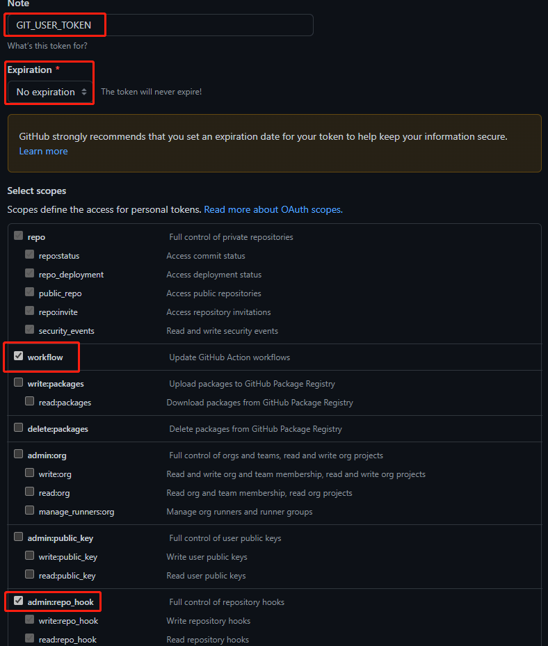

<div align="center"> 

<h1 align="center">

GitHub Actions For 360T7 OpenWrt

</h1>

[](https://github.com/hkk666/360T7/stargazers)
[](https://github.com/hkk666/360T7/network)
[](https://github.com/hkk666/360T7/issues)
[](https://github.com/hkk666/360T7/graphs/contributors)
[](https://github.com/hkk666/360T7/releases)
[](https://github.com/hkk666/360T7/blob/main/LICENSE)


</div>


## 友情提醒
此仓库只是拉取源码进行编译，本人并不会修复相关问题！
如果你遇到问题，可以提issues，我会尽力帮助你.

## 目录介绍

```tree
360T7
├── .github/workflows
│   ├── 360T7-hanwckf-mini.yml        云编译 360T7
│   ├── update-checker.yml            定时检查源码更新
├── doc
│   ├── backup                        旧文件备份
│   ├── config
│   │   ├──360T7-hanwckf-mini.config  固件定制
│   │   ├──ua2f.config                ua2f依赖
│   ├── diy                           自定义脚本文件
│   ├── img                           图片存放
├── LICENSE
└── README.md
```

## 食用教程

### 1.Fork本仓库

### 2.前往 [Settings/Developer settings](https://github.com/settings/tokens/new) 创建 `GIT_USER_TOKEN` `GITHUB_TOKEN` 密钥,如果你需要定时检查源码并自动触发编译，还需要创建 `ACTIONS_TRIGGER_PAT` 密钥.密钥创建页面,填入名称,Expiration选择 `no expiration` ,Select scopes选择`workflows` `admin:repo_hook`.
实例图示：



## 特别鸣谢

|          [lean](https://github.com/coolsnowwolf/lede)         |        [天灵](https://github.com/1715173329)               |              [lorz](https://github.com/1orz/My-action)               |              [P3TERX](https://github.com/P3TERX/Actions-OpenWrt)               |          [Zxilly](https://github.com/Zxilly/UA2F)         |           [dawidd6](https://github.com/dawidd6/action-send-mail)          |              [stupidloud](https://github.com/stupidloud/cachewrtbuild)               |              [hanwckf](https://github.com/hanwckf/immortalwrt-mt798x)               |
| :----------------------------------------------------------: | :----------------------------------------------------------: | :----------------------------------------------------------: | :----------------------------------------------------------: | :----------------------------------------------------------: | :----------------------------------------------------------: | :----------------------------------------------------------: | :----------------------------------------------------------: |
|  |  |  |  |  |  |  |  |

